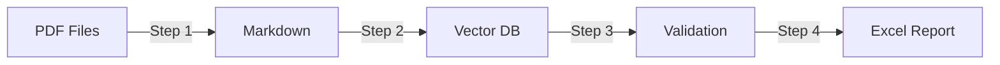

# 🏨 IHCL Hotel Contract RAG Pipeline

This project is an automated pipeline to extract structured contractual data from IHCL (Indian Hotels Company Limited) hotel agreement PDFs.

# 📂 Project Structure

```
pdf_to_md/
├── pdf_to_md_with_delimiter_v2.py   # Step 1
├── embedding_pipeline.py            # Step 2
├── verify_pipeline.py               # Step 3
├── query_v2.py                      # Step 4
├── inspect_chunks.py                # Debug tool
├── CORE_KEYS_LIST.py                # Key definitions

---

# 🔄 Pipeline Overview

The pipeline consists of **4 sequential steps**:



| Step | Script | Input | Output | Purpose |
|------|--------|-------|--------|---------|
| **1** | `pdf_to_md_with_delimiter_v2.py` | PDFs | Markdown | Extract text with page tracking |
| **2** | `embedding_pipeline.py` | Markdown | Qdrant DB | Generate embeddings & store vectors |
| **3** | `verify_pipeline.py` | Qdrant DB | Console logs | Validate data quality |
| **4** | `query_v2.py` | Qdrant DB | Excel files | Extract structured attributes |

---

# 📖 Usage

## Quick Start: Full Pipeline

```bash
# Ensure virtual environment is activated
.venv\Scripts\activate  # Windows
source .venv/bin/activate  # Linux/Mac

# Place PDF files in data/input_pdfs/

# Run full pipeline in sequence
python pdf_to_md_with_delimiter_v2.py
python embedding_pipeline.py
python verify_pipeline.py
python query_v2.py
```

---

## Step-by-Step Execution

### **STEP 1: PDF to Markdown**
Converts hotel contract PDFs into structured markdown with delimiters.

**Input:** `data/input_pdfs/*.pdf`  
**Output:** `pymupdf_markdowns/*.md`

```bash
python pdf_to_md_with_delimiter_v2.py

---

## embedding_pipeline.py
Purpose: Parses markdown, creates chunks, generates embeddings, and stores data in Qdrant.

Run:
python embedding_pipeline.py

---

## verify_pipeline.py
Purpose: Runs validation checks on stored vector data to ensure quality.

Run 
python verify_pipeline.py

---

## query_v2.py
Purpose: Extracts predefined attributes and exports them into structured Excel format.

Run:
python query_v2.py

---

## inspect_chunks.py
Purpose: Debug tool to inspect all chunks for a specific file stored in Qdrant.

Run (optional): for validation
python inspect_chunks.py

---

## CORE_KEYS_LIST.py
Purpose: Contains complete list of contract keys used for extraction and matching.

Run (optional):
python CORE_KEYS_LIST.py
```

Prints all 70+ contract attributes that will be extracted.

---

# 🚀 Execution Order

```bash
# Full pipeline — run in order:
python pdf_to_md_with_delimiter_v2.py      # Step 1: PDF → Markdown
python embedding_pipeline.py         # Step 2: Markdown → Qdrant
python verify_pipeline.py            # Step 3: Quality checks
python query_v2.py                   # Step 4: Extract → Excel
```

---

# ⚠️ Notes

- Qdrant DB is stored locally in `./qdrant_local` (excluded from git)
- Always activate virtual environment before running scripts
- Query results are timestamped to avoid overwrites
- Logs directory auto-created by `run_with_log.py`
- `.env` file is gitignored - never commit API keys

---

# 🤝 Support

For issues or questions:
1. Check logs in `logs/` directory
2. Run verification: `python verify_pipeline.py`
3. Inspect specific file: `python inspect_chunks.py`

---

*Built for IHCL — Indian Hotels Company Limited (Tata Group)*  
*Powered by Azure OpenAI, Qdrant Vector Database, and RAG Architecture*
